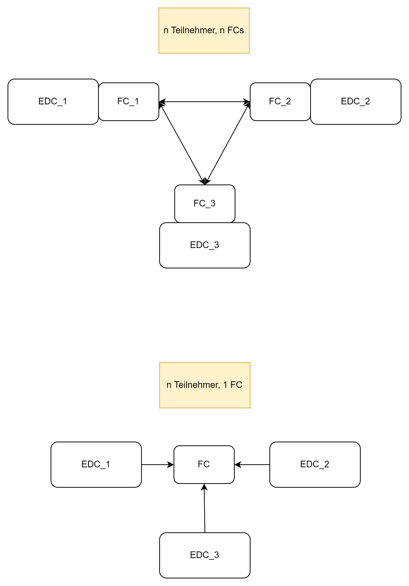

# Federated Catalog

Der Federated Catalog (FC) entspricht einer Liste sämtlicher Teilnehmer eines Datenraumes mitsamt ihrer angebotenen Services und Assets. Die Federated Catalog-Implementierung des AW4.0-EDC
sieht vor, dass jeder Teilnehmer im Datenraum einen eigenen Federated Catalog enthält, dieser also dezentral organisiert ist. In einem Datenraum mit n Teilnehmern gibt es also
n FCs. Das Gegenstück zu diesem Konzept wäre ein zentral-organisierter FC, n Teilnehmer greifen also auf 1 FC zu.



Der FederatedCatalogApiController der FC-Extension liefert drei weitere Endpunkte zu den bereits vorhandenen:

## /federatedcatalog

Dieser Endpunkt gibt die zuvor beschriebene Liste sämtlicher Datenraumteilnehmer mitsamt ihrer angebotenen Services und Assets zurück. Der EDC erwartet hierbei eine explizite Query im JSON-Body.

Beispiel:

````
{
    "@context": {
    "edc": "https://w3id.org/edc/v0.0.1/ns/"
    },
    "querySpec": {
    "offset": 0,
    "limit": 50,
    "sortOrder": "DESC",
    "sortField": "fieldName",
    "filterExpression": []
    }
}
````
## /insert

Mithilfe dieses Endpunkts könnten weitere Datenraumteilnehmer in dem jeweils eigenen Federated Catalog registriert werden.

Beispiel:

Ein neuer Datenraumteilnehmer (HSOS) ist im Besitz des EDC_2, der Datenraumteilnehmer LMIS mit EDC_1 möchte diesen crawlen. Hierzu sendet dieser einen POST-Request an seinen eigenen /insert-Endpunkt mit dem folgenden Body:

````
{
    "name": "HSOS",
    "url": "http://host.docker.internal:8282/protocol",
    "supportedProtocols": [
        "dataspace-protocol-http"
    ]
}
````

Der Datenraumteilnehmer LMIS kann nun seinen eigenen /federatedcatalog-Endpunkt mit der im Beispiel hinterlegten Query ansprechen und erhält den folgenden Eintrag:

````
[
    {
        "@id": "e3f5436b-ee50-4ea9-ad7d-2cc46f164105",
        "@type": "dcat:Catalog",
        "dcat:dataset": [],
        "dcat:service": {
            "@id": "135543b0-2aa1-49e8-9079-bd307020fea0",
            "@type": "dcat:DataService",
            "dct:terms": "connector",
            "dct:endpointUrl": "http://host.docker.internal:8282/protocol"
        },
        "edc:originator": "http://host.docker.internal:8282/protocol",
        "edc:participantId": "provider",
        "@context": {
            "dct": "https://purl.org/dc/terms/",
            "edc": "https://w3id.org/edc/v0.0.1/ns/",
            "dcat": "https://www.w3.org/ns/dcat/",
            "odrl": "http://www.w3.org/ns/odrl/2/",
            "dspace": "https://w3id.org/dspace/v0.8/"
        }
    }
]
````

Falls "HSOS" zusätzlich ein Asset bei sich registriert, erweitert sich der Eintrag zu:

````
[
    {
        "@id": "3d2e3930-7454-4974-82ea-8f8f2e0dc665",
        "@type": "dcat:Catalog",
        "dcat:dataset": {
            "@id": "Messergebnis",
            "@type": "dcat:Dataset",
            "odrl:hasPolicy": {
                "@id": "MQ==:TWVzc2VyZ2Vibmlz:MjBhZGM5MGMtNTdjYi00MzlmLWE3ZWMtZjlmMWQ4NzhkMTQ3",
                "@type": "odrl:Set",
                "odrl:permission": [],
                "odrl:prohibition": [],
                "odrl:obligation": [],
                "odrl:target": "Messergebnis"
            },
            "dcat:distribution": [
                {
                    "@type": "dcat:Distribution",
                    "dct:format": {
                        "@id": "HttpProxy"
                    },
                    "dcat:accessService": "135543b0-2aa1-49e8-9079-bd307020fea0"
                },
                {
                    "@type": "dcat:Distribution",
                    "dct:format": {
                        "@id": "HttpData"
                    },
                    "dcat:accessService": "135543b0-2aa1-49e8-9079-bd307020fea0"
                }
            ],
            "edc:name": "product description",
            "edc:id": "Messergebnis",
            "edc:contenttype": "application/json"
        },
        "dcat:service": {
            "@id": "135543b0-2aa1-49e8-9079-bd307020fea0",
            "@type": "dcat:DataService",
            "dct:terms": "connector",
            "dct:endpointUrl": "http://host.docker.internal:8282/protocol"
        },
        "edc:originator": "http://host.docker.internal:8282/protocol",
        "edc:participantId": "provider",
        "@context": {
            "dct": "https://purl.org/dc/terms/",
            "edc": "https://w3id.org/edc/v0.0.1/ns/",
            "dcat": "https://www.w3.org/ns/dcat/",
            "odrl": "http://www.w3.org/ns/odrl/2/",
            "dspace": "https://w3id.org/dspace/v0.8/"
        }
    }
]
````

## /participants

Dieser Endpunkt liefert eine Liste aller Datenraumteilnehmer gemäß der Attribute Name, Connector-Url und Protokoll-Spezifikation zurück, die beim Registrieren gesetzt worden sind.

Beispiel:


````
[
    {
        "name": "HSOS",
        "url": "http://host.docker.internal:8282/protocol",
        "supportedProtocols": [
            "dataspace-protocol-http"
        ]
    },
    {
        "name": "THGA",
        "url": "http://edc-thga:8282/protocol",
        "supportedProtocols": [
            "dataspace-protocol-http"
        ]
    }
]
````

## Konfigurationsmöglichkeiten

Es gibt insgesamt drei Eigenschaften, die in der properties-Datei des EDC bezüglich des FC gesetzt werden können:

### edc.catalog.cache.execution.delay.seconds

Anzahl an Sekunden, bis der EDC initial den ersten Crawling-Vorgang startet.

Beispiel:

edc.catalog.cache.execution.delay.seconds=10

bedeutet, dass der FC das erste Mal 10 Sekunden nach Start des EDC aktualisiert wird.

### edc.catalog.cache.execution.period.seconds

Häufigkeit des Crawling-Prozesses in Sekunden.

Beispiel:

edc.catalog.cache.execution.period.seconds=5

bedeutet, dass der Federated Catalog sich alle 5 Sekunden aktualisiert (nach dem initalen Crawling-Vorang, s. vorheriger Absatz).

### edc.catalog.cache.partition.num.crawlers

Anzahl an Crawlern, die die sogenannten "Work Items" crawlen.

Beispiel:

edc.catalog.cache.partition.num.crawlers=2

bedeutet, dass im Falle von 10 Work Items jeder Crawler 5 Work Items crawled.
